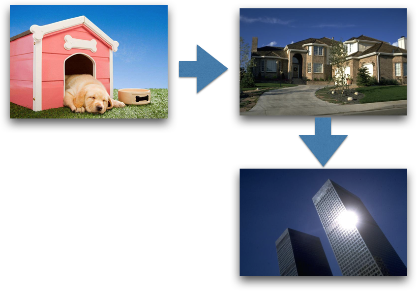
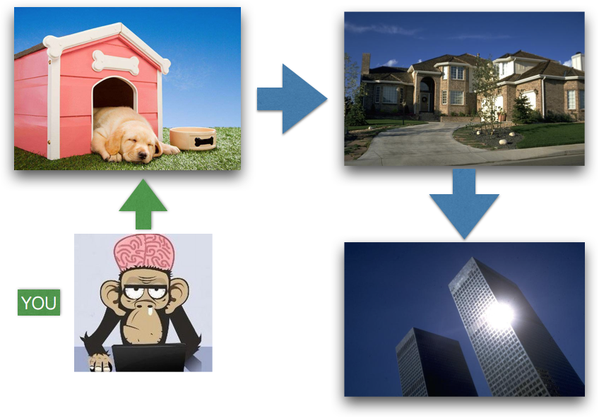
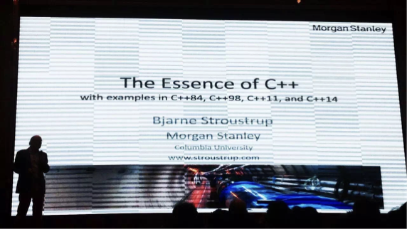
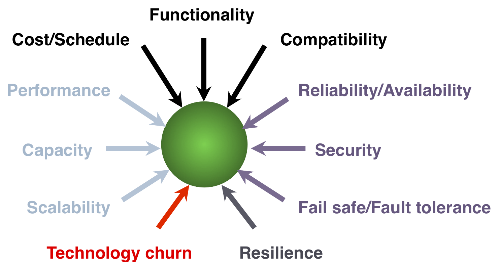
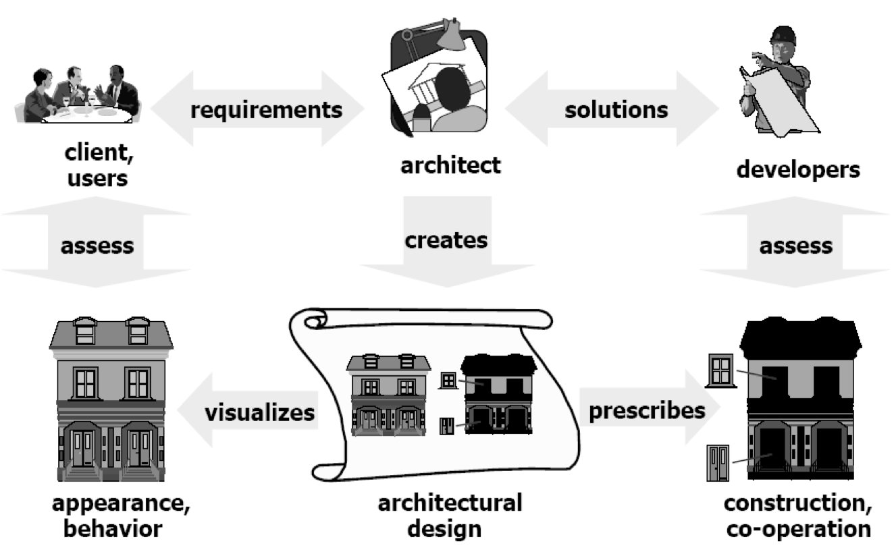
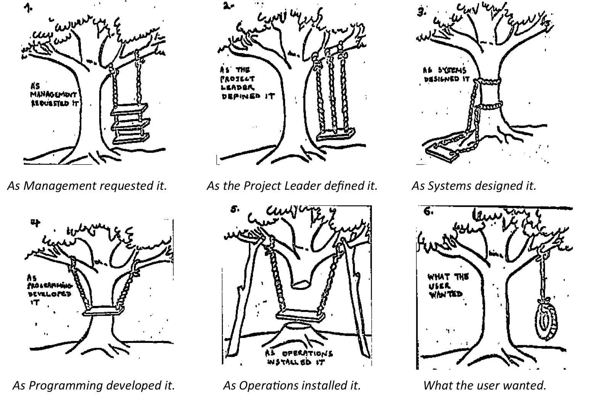
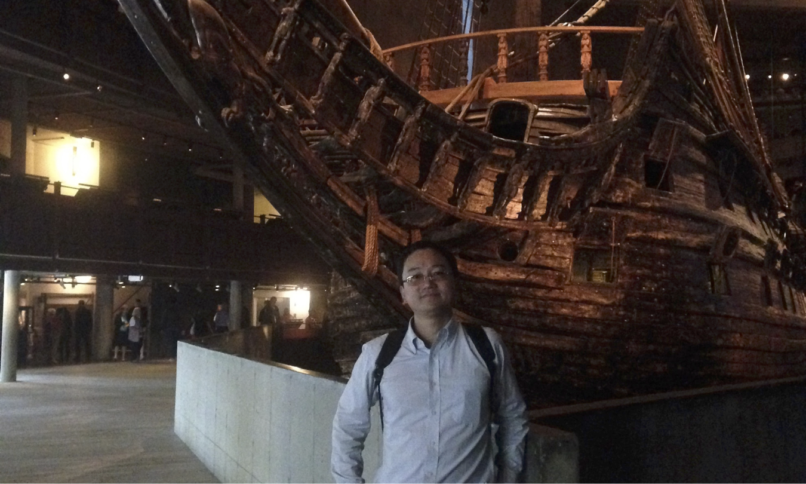
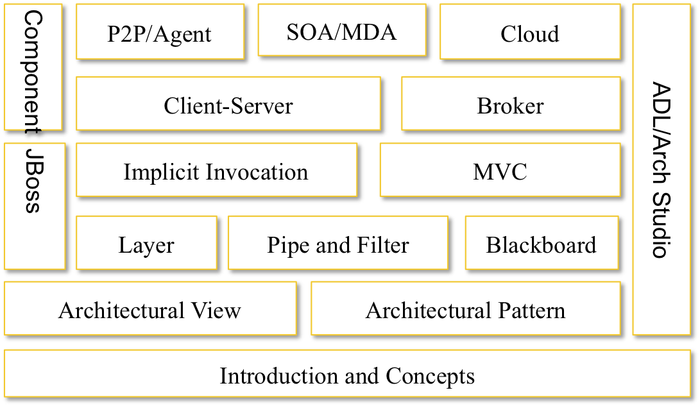

# 软件体系结构
## Software Architecture

---

## 课程网站

https://github.com/njuics/sa-2019 

---

## QQ群

  <!-- .element height="60%" width="35%" -->

---

## 这门课是学什么的？

- 如何开发一个软件？
- 如何读懂一个软件？
- 如何解决软件中的问题？ 

软件设计问题  <!-- .element: class="fragment" style="font-weight: bold;" -->

---

## 内容及目标

- 介绍软件体系结构的基本概念、理论等
- 着重讲解多个流行软件系统（平台）的体系结构
- 传递一些系统设计和软件开发的相关知识
- 使对主流技术获得初步的了解
- 实践“真实”的软件设计和开发

---

## 核心内容

从软件体系结构的角度，较为系统化地介绍实际软件设计原理、方法和主流软件技术

---

我都已经会了N门语言了

为什么还要选这课？

---

Software Architecture

“软件建筑学”

---

## Architecture

- The art or science of building or constructing edifices of any kind for human use
- The action or process of building
- Architectural work; structure, building
- The special method of ‘style’ in accordance with which the details of the structure and ornamentation of a building are arranged
- Construction or structure generally
- The conceptual structure and overall logical organization of a computer or computer-based system from the point of view of its use or design; a particular realization of this

---

## Architecture

  <!-- .element height="70%" width="70%" -->

---

## Architecture

 <!-- .element height="70%" width="70%" -->

---

软件开发是门学问

---

Bjarne Stroustrup（比雅尼·斯特劳斯特鲁普）

 

Our civilization runs on software. 
		
---

## 计算机软件发展

- 第一阶段：-60s，小规模程序，个人作品
- 第二阶段：60s-70s，多道程序、多用户系统，软件作坊
- 第三阶段：70s-80s，网络化，分布式数据访问
- 第四阶段：80s-，人工智能、多媒体、虚拟现实、网络化计算

---

## 软件危机(Software Crisis)

- 1968年，联邦德国，NATO科技委员会
 - 成本不断提高
 - 开发进度难以控制
 - 质量低下
 - 维护困难
 - 用户难以满意

软件生产率赶不上硬件发展和用户需求增长

---

## Software is so bad

- Software is
  - Buggy
  - Unreliable
  - Forever changing
  - unwarrantable

Parnas, 1985

---

## The Unsuitability of Software

- U.S. Army study of Federal projects:
  - 47% delivered, but not used
  - 29% paid for, but not delivered
  - 19% abandoned or reworked
  - 3% used after changes
  - 2% used as delivered

---

## 原因

- 软件本身相关（内因）
 - 纯思维活动，进展，质量难以掌握控制，问题规模决定软件规模
- 开发过程相关（外因）
 - 软件人员自身素质，合作开发管理水平，人员自身知识更新
- 用户需求不明确
 - 缺乏正确理论指导，软件规模越来越大，软件复杂度越来越高

---

## 解决途径

软件工程(Software Engineering) 是一门研究如何用系统化、规范化、数量化等工程原则和方法去进行软件的开发和维护的学科

---

## 软件工程

- 软件开发技术
  - 开发方法学，软件工具，软件工程环境
- 软件项目管理
  - 项目估算，进度控制，人员组织，项目计划

---

## 生命周期模型

---

## Software development has been, is, and remains hard

  <!-- .element height="50%" width="70%" -->

---

## Software architecture

- 研究动机
  - 随着软件系统规模越来越大、越来越复杂，整个系统的结构和规格说明显得越来越重要
  - 对于大规模的复杂软件系统来说，对总体的系统结构设计和规格说明比起对计算的算法和数据结构的选择已变得明显重要得多
  - 对于软件体系结构的系统、深入的研究将会成为提高软件生产率和解决软件维护问题的新的最有希望的途径
  - 对于软件体系结构的研究成为了最新的研究方向和独立学科分支

---

## Software architecture defined

The software architecture of a program or computing system is the <bdi style="color:red;">_structure or structures of the system_</bdi>, which comprise <bdi style="color:red;">_software elements_</bdi>, <bdi style="color:red;">_the externally visible properties_</bdi> of those elements, and the <bdi style="color:red;">_relationships among them_</bdi>.

Clements et al., 1997

---

## Some other definitions

- Perry and Wolf, 1992
  - A set of architectural (or design) elements that have a particular form
- Boehm et al., 1995
  - A collection of software and system components, connections, constraints and system stakeholders' need statements
  - A rationale which demonstrates that the components, connections, and constraints define a system that would satisfy the collection of system stakeholders' need statements

---

## 关乎设计

- David Garlan and Mary Shaw
  - 在计算的算法和数据结构之外，设计并确定系统整体结构成为了新的问题，包括
    + 总体组织结构和全局控制结构
    + 通信、同步和数据访问的协议
    + 设计元素的功能分配
    + 物理分布
    + 设计元素的组成
    + 定标与性能
    + 备选设计的选择

---

## 架构师

架构师实际上就是软件的总体设计师。首席设计师就是总设计师，打个通俗的比方：邓小平是中国改革开放的总设计师，我们用现在的说法可以讲，邓小平是中国改革开放的首席架构师。 

---

## Overall

  <!-- .element height="50%" width="45%" -->

<small>Architectural decisions are the most fundamental decisions. Changing them will have significant ripple effects. </small>

---

## Why is SA important?

- 软件开发组织的一种核心财富
  - Communication among stakeholders
  - Early design decisions. 
  - Transferable abstraction of a system

---

## SA as communication among stakeholders

  <!-- .element height="60%" width="60%" -->

---

##  Characteristics concerned

- The user – is the system reliable and available when needed?
- The customer – can the architecture be implemented on schedule and to budget?
- The manager  – will that the architecture allow teams to work largely independently, interacting in disciplined and controlled ways?
- The architect – will the strategies to achieve all of those goals?

---

## mis-communication

  <!-- .element height="70%" width="80%" -->

---

## SA as the earliest set of design decisions

- defines constraints on implementation
- dictates organizational structure
- inhibits or enables a system's quality attributes
- Performance/ modifiability/security/scalability/inter-couple
- predicts system qualities by studying the architecture
- makes it easier to reason about and manage change
- helps in evolutionary prototyping
- enables more accurate cost and schedule estimates

---

## Swedish Warship Vasa

  <!-- .element height="60%" width="60%" -->

70 meters long, carry 300 soldiers,  64 heavy guns mounted on  two decks

---

## Vasa-Me

  <!-- .element height="50%" width="60%" -->

---

## Lessons from Vasa

- Case studies of successful architectures crafted to satisfy demanding requirements, so as to help set the technical playing field of the day.
- Methods to assess an architecture before any system is built from it, so as to mitigate the risks associated with launching unprecedented designs.
- Techniques for incremental architecture-based development, so as to uncover design flaws before it is too late to correct them.

---

## 软件体系结构的发展史

- 70年代中后期
  - 结构化，数据流/控制流设计
- 80年代-90年代中期
  - OO， UML，对象建模，结构视图
- 90年代中后
  - 构件化技术和体系结构技术，4+1模型等

---

## 研究现状

- 体系结构的描述、分析、设计
- 体系结构的测试验证、发现、演化、重用
- 基于体系结构的开发方法
- 特定领域的体系结构框架
- 软件体系结构支持工具
- 软件产品线体系结构
- 软件体系结构评价方法

---

## 我们到底讲什么？

  <!-- .element height="50%" width="60%" -->

---

## 内容

  <!-- .element height="50%" width="60%" -->

---

## 此外

- 实例分析
  + Eclipse
  + LLVM
  + Sendmail
  + Hadoop
  + SocialCal
  + …

---

## 去年

https://github.com/njuics/sa-2018/wiki

---

## 大作业

微服务架构的分布式文件系统设计与实现

https://github.com/njuics/sa-2018/wiki/%E8%AF%BE%E7%A8%8B%E5%A4%A7%E4%BD%9C%E4%B8%9A

---

## 参考书

- 《Patterns of Enterprise Application Architecture》，Martin Fowler, Addison Wesley
- 《Software Architecture in Practice, Second Edition》， Len Bass, Paul Clements, Rick Kazman， Addison Wesley
- 《Component Software: Beyond Object-Oriented Programming 》，Clemens Szyperski ， ACM Press

---

## 参考

The Architecture of Open Source Applications

http://aosabook.org/

---

## 如何拿到学分？

- 平时到课
- 课程作业
  - 一篇调研报告
  - 若干次小作业
  - 大作业：基于主流技术的应用设计开发
- 闭卷考试

---

  <!-- .element height="30%" width="60%" -->