# 架构视图
## Architecture View

---

## 回顾

“The software architecture of a program or computing system is the structure or structures of the system, which comprise software elements, the externally visible properties of those elements, and the relationships among them.” 

---

## Example -Windows

 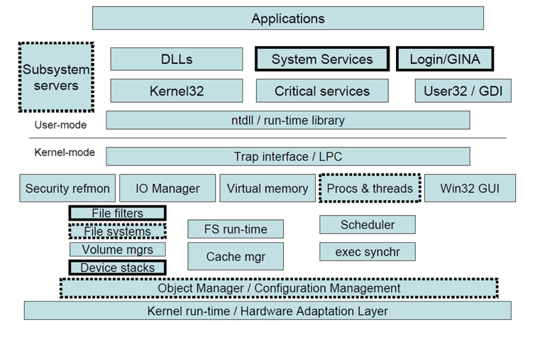 

---

## Example - 网络系统

 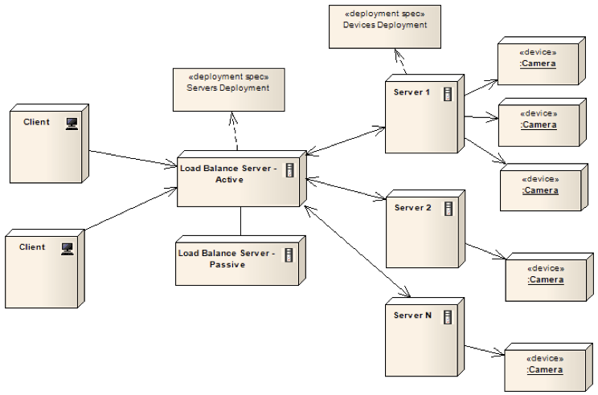 

---

## Example - Web应用

 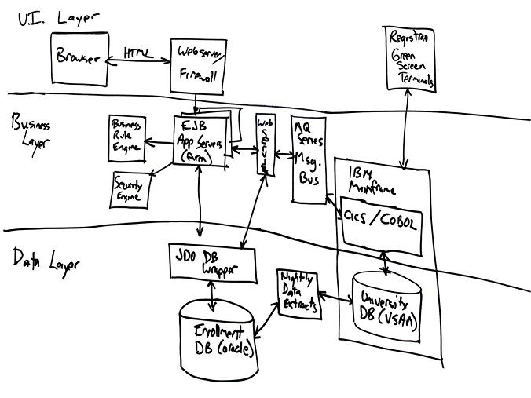 

---

## Example - Hadoop

 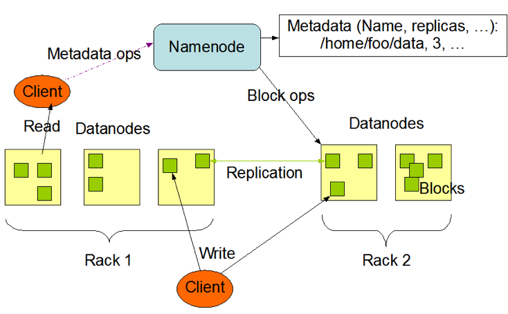 

---

## Software Architecture

“The software architecture of a program or computing system is the structure or structures of the system, which comprise software elements, the externally visible properties of those elements, and the relationships among them.” 

软件设计  <!-- .element: class="fragment" style="font-weight: bold;" -->

---

## 设计

 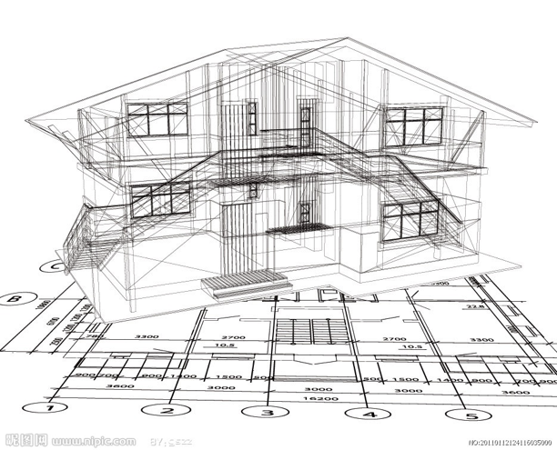 

---

## 现场图

 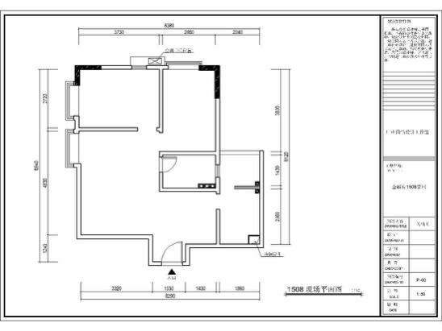 

---

## 布置图

 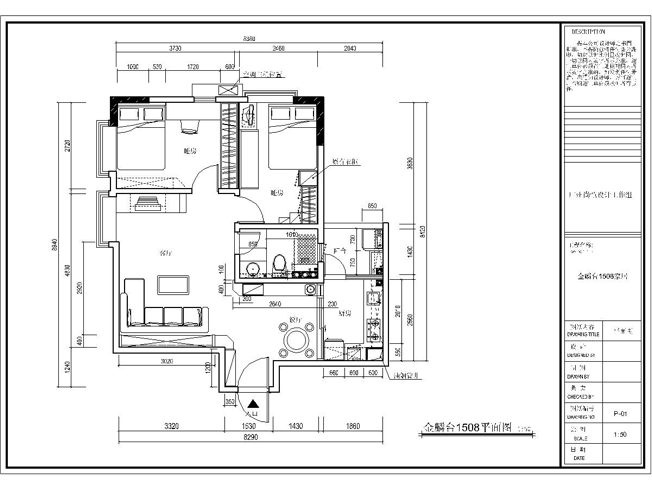 

---

## 天花板图

 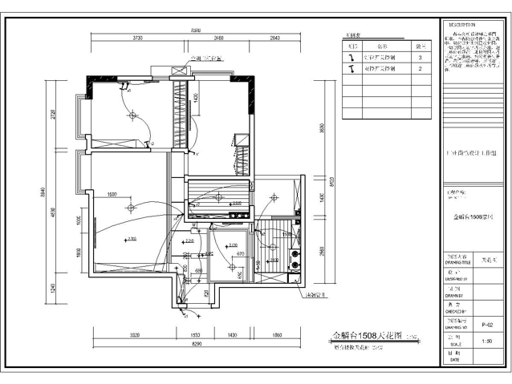 

---

## 插座图

 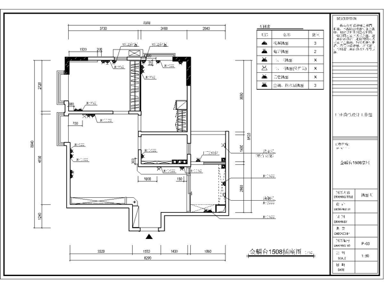 

---

## 地面图

 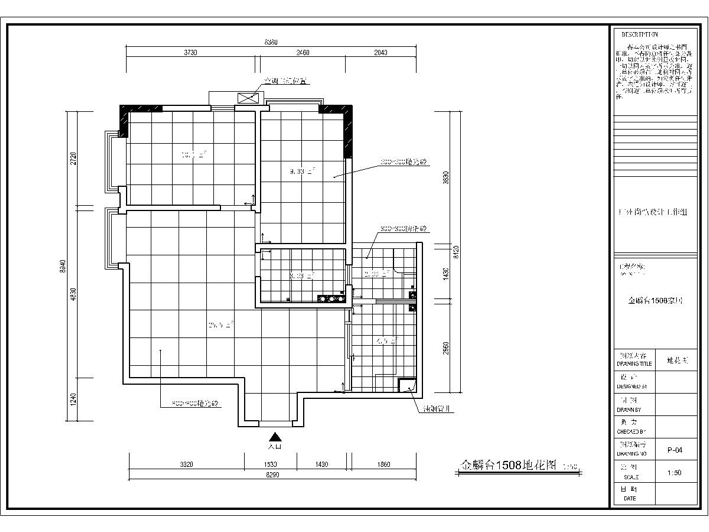 

---

## 门图

 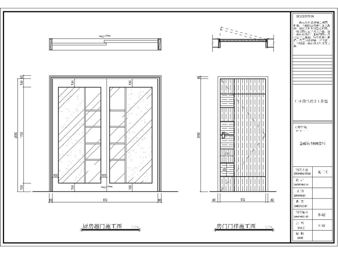 

---

## 医学图

  

---

## 软件体系结构

- 软件系统最高层次的设计决策问题
  - 多方面的设计问题
  - 系统复杂性导致不能将各方设计一次性考虑完备

---

## 体系结构视图

- 当前关注点下对体系结构的考察视角
  - 着重考虑某些问题
  - 忽略与此视角无关之内容
- 表达了某一组系统元素及其之间的关系
  - stakeholders所关注的
  - 元素集及关系集存在于具体系统之中

---

## 体系结构视图分类

- 模块（ Module）视图
  - 刻画模块（实现单元）的关系
- 构件连接件（ Component-and-connector ）视图
  - 刻画运行时刻计算部件（Component）及其间交互关系（Connector）
- 分配（ Allocation ）视图
  - 刻画软件系统与外界环境间的关系

---

## 模块视图

- 刻画模块（实现单元）的关系，功能划分状态
  - 模块功能是什么？
  - 模块可使用哪些模块？
  - 模块与模块间关系是什么？（泛化？具体化？）
    - Decomposition/Uses/Layered/Generalization

---

## 构件连接件视图

- 刻画运行时刻计算部件（Component）及其间交互关系（Connector），运行状态
  - 运行时刻有哪些执行部件？他们之间如何交互？
  - 哪些部件可并行执行？数据处理如何进行？
  - 执行过程中系统结构如何变化？
- 关系
  - Communicating processes/Concurrency/Shared data

---

## 分配视图

- 刻画软件系统与外界环境间的关系
  - 与外界元素间的映射状态
  - 某软件元素在哪个处理器上执行？
  - 如何为各开发小组的分配开发任务？
- 关系
  - Deployment/Implementation/Work assignment

---

## 体系结构视图

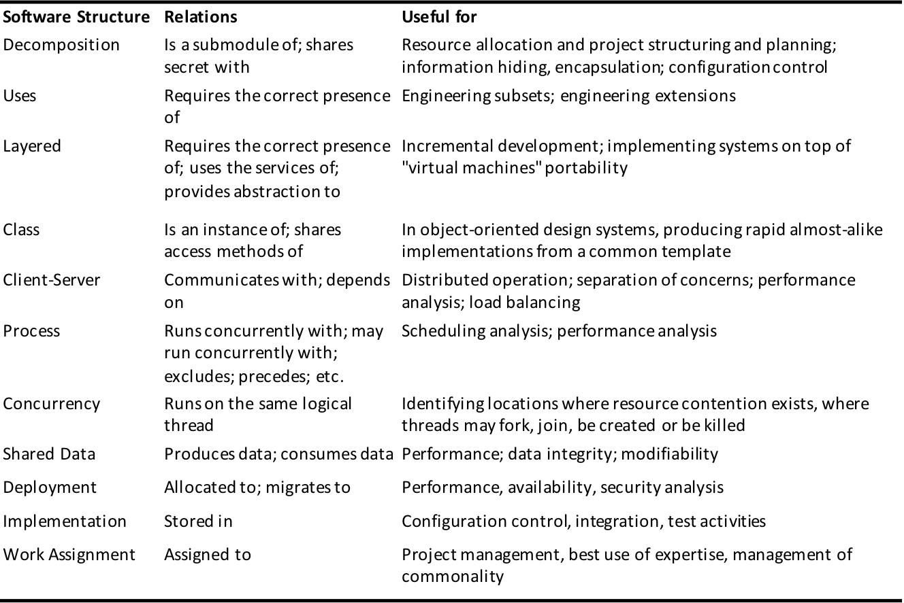  <!-- .element height="60%" width="60%" -->

到底需要哪个？ <!-- .element: class="fragment" style="font-weight: bold;" -->

---

## 4+1视图

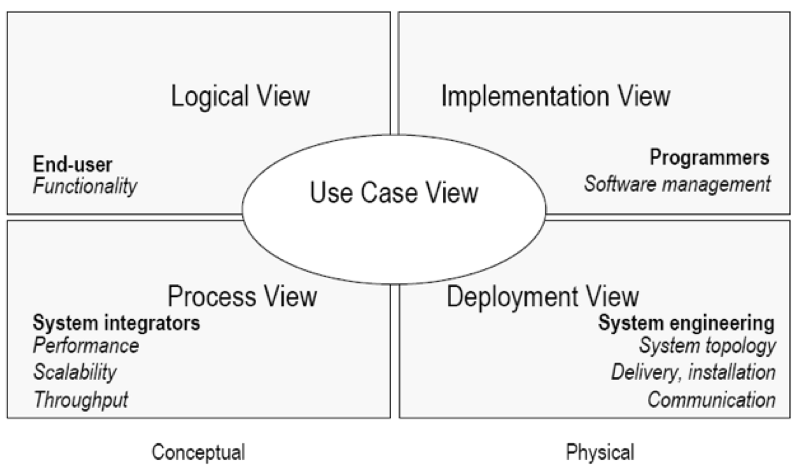  <!-- .element height="60%" width="80%" -->

Philippe Kruchten, 1995

---

## 逻辑视图（Logical View）

- 应用相关核心概念的抽象
  - 元素（类），
  - 关系（泛化，依赖，聚合等等）
  - 主要关注功能需求

---

## 逻辑视图

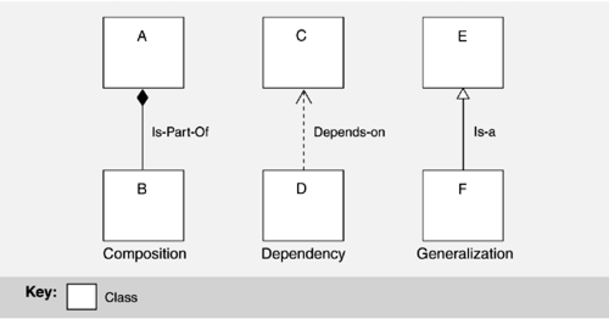  <!-- .element height="60%" width="80%" -->

---

## 过程视图(Process View)

- 刻划 并发 、同步、分布等特性
- 专注于性能、容错、可用性、系统一致性等非功能质量属性方面的考虑

---

## 过程视图

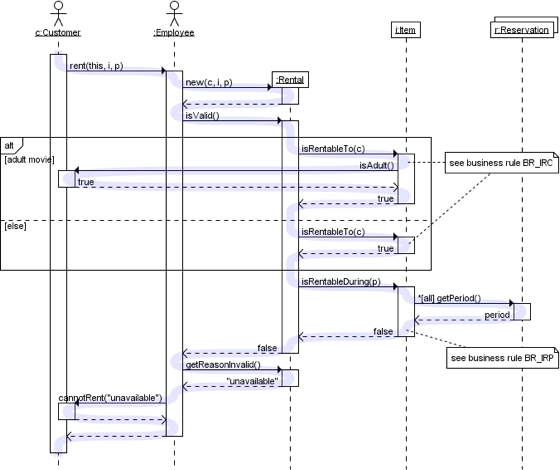 

---

## 过程视图

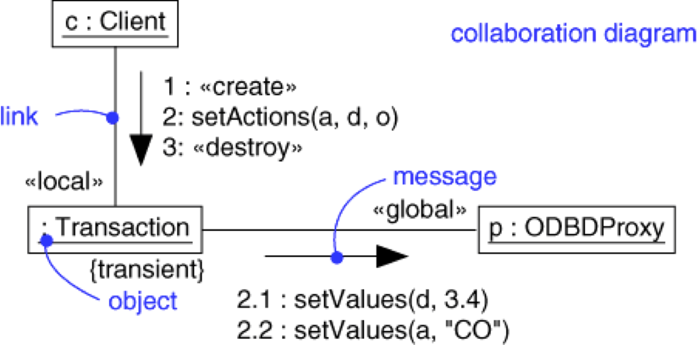  <!-- .element height="60%" width="80%" -->

---

## 实现(开发)视图(Implementation /Development View)

- 软件的静态组成：模块划分，相互联系
- 软件的开发方便程度、复用、模块化等内部质量因素和工程组织管理因素

---

## 实现视图

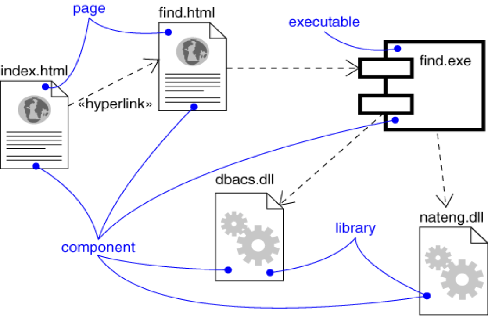  <!-- .element height="55%" width="60%" -->

---

## 部署视图(Deployment View)

- 原称物理视图（Physical View）
- 软件模块的物理分布
- 关注可用性、可靠性、性能、扩展性等非功能指标

---

## 部署视图

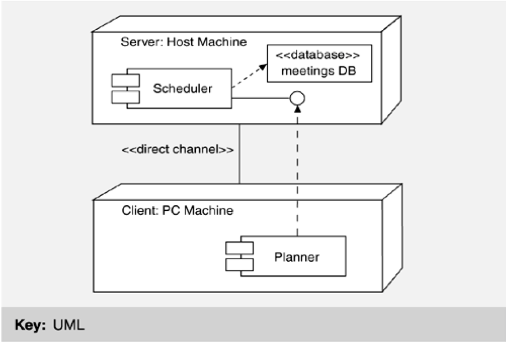 <!-- .element height="60%" width="60%" -->

---

## 用例视图(Use Case View)

- 用若干用例来串接上述四个视图（＋1）
- 两方面作用
  + 各个视图的设计，实际上均是从用例出发来发现其中的元素、关系等
  + 通过用例场景的推演，来展示并验证体系结构。
    
这是对体系结构的“测试”。

---

## 用例视图

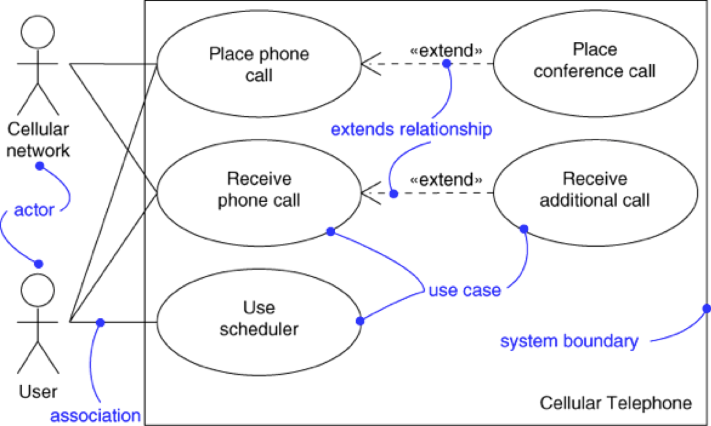<!-- .element height="50%" width="60%" -->

---

## 视图的取舍

- 依据所关心的质量因素作取舍
- 并非一定要面面俱倒
  - 单机软件  一般无需 部署视图
  - 串行程序  可能无需 过程视图
  - ……

---

To be continued...