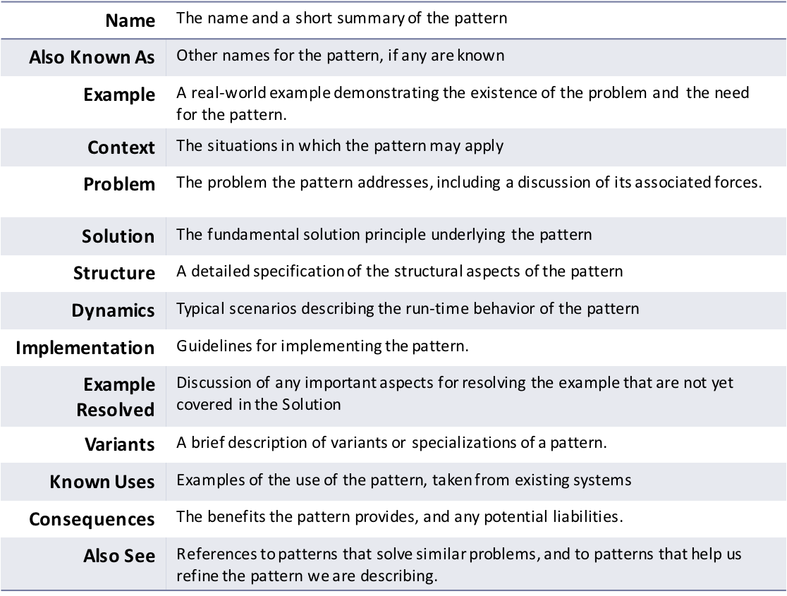

# 架构模式
## Architectural Patterns

---

## 还是从建筑谈起

---

## 还有

  

---

## 甚至于

- 塔楼
- 板楼

相对稳定且不断被沿用的建筑设计：Patten  <!-- .element: class="fragment" style="font-weight: bold;" -->

---

## Patterns

- 定义 
  - A pattern is a solution to a problem in a context
  - A pattern is a three-part rule, which expresses a relation between a certain context, a problem, and a solution
- A pattern codifies specific knowledge collected from experience in a domain

---

## Patterns in software

- Known from practical experience
- To follow in developing software systems
- To achieve specific properties
- To solve the design problems effectively and elegantly

---

## Patterns

- Blackboard
- Client-server (2-tier, 3-tier, n-tier, cloud computing exhibit this style)
- Component-based
- Data-centric
- Event-driven (or Implicit invocation)
- Layered (or Multilayered architecture)
- Monolithic application
- Peer-to-peer (P2P)

---

## Patterns

- Pipes and filters
- Plug-ins
- Representational state transfer (REST)
- Rule-based
- Service-oriented architecture and microservices as its implementation approach
- Shared nothing architecture
- Space-based architecture

---

## Example

- Context
  - 人机交互界面设计
- Problem
  - 系统功能的变化要求用户界面的改变
  - 系统升级要求用户界面的升级
  - 系统平台的改变（移植）要求用户界面随之改变
  - 用户界面的改变需足够方便
  - 用户界面的改变不应影响系统功能本身

---

## Solution： MVC

- 系统分割为processing, output和input三个部分
  - “Model”: processing，核心数据和功能，
  - “View”: output, 从Model获得数据并显示给用户, 
  - “Controller”: input, 处理事件操作模型

--- 

## MVC

  <!-- .element height="50%" width="60%" -->

---

## Pattern特点 

- 解决在特定情况下经常出现的需要解决的设计问题
- 记录并保存了已有的优良的设计经验
- 支持构造具有既定属性的系统
- 但是，依然是一个抽象、一般性的解决方案，而非预制的、可直接使用的方案

---

## Pattern组成

- Context： Design situation giving rise to a design problem
  - <small>developing software with a human-computer interface</small>
- Problem: Set of forces repeatedly arising in the context
  - Requirements the solution must fulfill
    - <small>peer-to-peer inter-process communication must be efficient.</small>
  - Constraints you must consider
    - <small>inter-process communication must follow a particular protocol</small>
  - Desirable properties the solution should have
    - <small>changing software should be easy</small>

---

## Solution

- Configuration to balance the forces

  - Static structure
    - <small>‘Divide an interactive application into the three areas: processing, output, and input.'</small>
  - Runtime behavior
    - <small>'Controllers receive input, usually as events that denote mouse movement, activation of mouse buttons, or keyboard input. Events are translated to service requests, which are sent either to the model or to the view'.</small>

---

## Pattern分类

- Architectural patterns
  - Help in structuring a software system into subsystems
- Design patterns
  - Support the refinement of subsystems and components
- Idioms
  - Help in implementing particular design aspects in a specific programming language

---

## Architectural Patterns

- Expresses a fundamental structural organization schema for software systems. It provides a set of predefined subsystems, specifies their responsibilities, and includes rules and guidelines for organizing the relationships between them.
  - System-wide fundamental design decision
    - E.g. MVC provides a structure for interactive software system

---

## Design Patterns

- Provides a scheme for refining the subsystems or components of a software system, or the relationships between them. It describes a commonly-recurring structure of communicating components that solves a general design problem within a particular context
  - Medium-scale, independent of a particular programming language
    - E.g. Observer/Publisher-subscribe patterns address the effective cooperation between components

---

## Idioms

- A low-level pattern specific to a programming language. An idiom describes how to implement particular aspects of components or the relationships between them using the features of the given language.
  - Lowest-pattern: address aspects of both design and implementation
  - Language-specific: different in different language, could be invalid if language changes
    - E.g. object reference counting in C++ v.s. GC in JAVA

		
---

## Pattern的描述

   <!-- .element height="60%" width="60%" -->

---

## Architectural Patterns/Styles

- Structured Systems
  - Controlled decomposition
- Distributed Systems
  - Communication coordination
- Interactive Systems
  - Human-computer interaction
- Adaptable Systems
  - Extension and evolution

---

TBC...